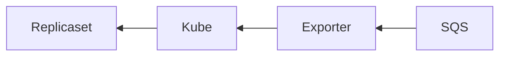
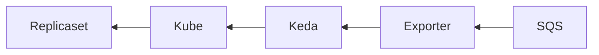
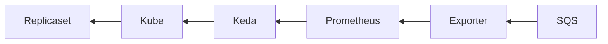
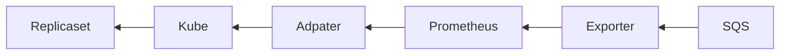

# Demo Kubernetes Autoscaling

Jérôme Gurhem, Lilia Ziane Khodja, Wilfried Kirschenman @ Aneo

---

- Use case
- Demo
- Technical choices

---

## Use case

- Scaling a kubernetes replicaset
- AWS EKS
- Metrics from AWS SQS
- Allow custom processing of the metrics from SQS

---

# Demo

- code : [Github repository](https://github.com/aneoconsulting/Demo.Kubernetes.Autoscaling)
- Part 1 : infrastructure
- Part 2 : application and autoscaling

---

## Technical details

- Test client
- Metrics exporter
- Metrics registration in Kubernetes

---

## Test client

- Inserts/removes messages from a given SQS queue
- Uses .Net 6 AWS Sdk
- Docker container is provided for convenience
- AWS Sdks also available in C++, Python, Go, Java, [etc..](https://aws.amazon.com/fr/tools/)

---

## Metrics exporter for Keda

- Retrieves the number of messages in the given SQS queue
- Uses .Net 6 AWS Sdk and gRPC server tools for .Net
- Docker container for deployment as pod
- gRPC bindings generators for C++, Python, Go, Java, [etc..](https://grpc.io/docs/languages/)
- [Keda external scaler](https://keda.sh/docs/2.7/concepts/external-scalers/)

---

## Metrics registration in Kubernetes

- Metrics exporter for Kubernetes
- Metrics exporter + Keda
- Metrics exporter + Prometheus + Keda
- Metrics exporter + Prometheus + Prometheus adapter

---

## Autoscaling

- Adjust number of resources depending on workload without human action
- Kubernetes : changing the number of pods in a replicaset
- Native support for CPU and Memory not suitable
- How to use Custom/External Metrics ?

---

## Metrics exporter for Kubernetes

---

## Metrics exporter for Kubernetes

- Metrics directly given to Kubernetes
- Difficult configuration
- Metric format not really clear
- No history
- Difficult to manage several instances in the same cluster

---

## Metrics exporter + Keda

---

## Metrics exporter + Keda

- Keda makes the interface between the exporter
- One instance of Keda that exposes the metrics to Kubernetes
- No history

---

## Metrics exporter + Prometheus + Keda

---

## Metrics exporter + Prometheus + Keda

- History through Prometheus
- One instance of Keda that exposes the metrics to Kubernetes
- Keda makes the configured request to Prometheus to compute the metric
- Supports multiple instances of metrics + replicaset
- Metrics can be explored with tools such as Grafana

---

## Metrics exporter + Prometheus Adapter + Prometheus

---

## Metrics exporter + Prometheus Adapter + Prometheus

- History through Prometheus
- One instance of Keda that exposes the metrics to Kubernetes
- Difficult to deploy multiple instances of metrics + replicaset

---

## Conclusion

- Large number of tools to implement autoscaling in Kubernetes
- Depends on the use case
- Metrics exporter (+ Promtheus) + Keda is a promising solution
  - Easy to deploy
  - Supports multiple instances
  - Prometheus can help to keep metric history and use more complex requests

